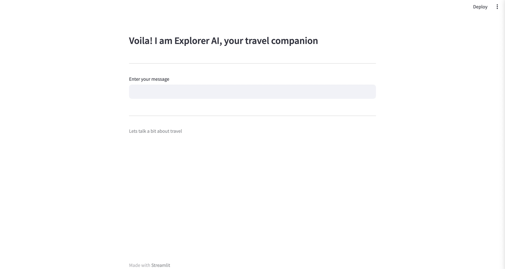
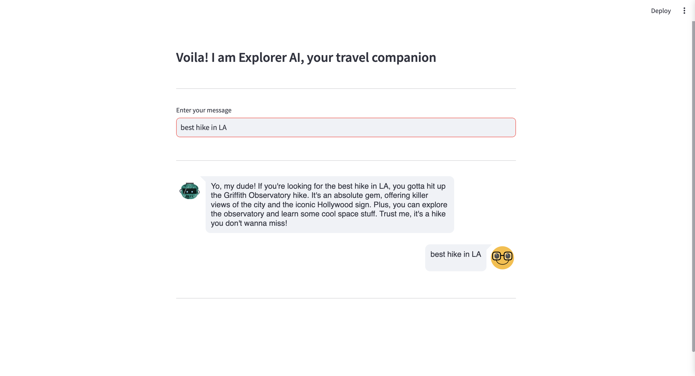
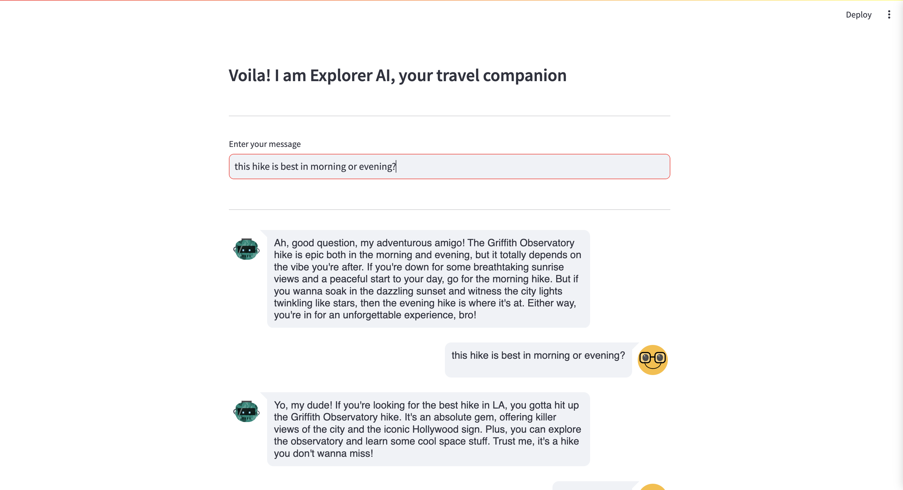
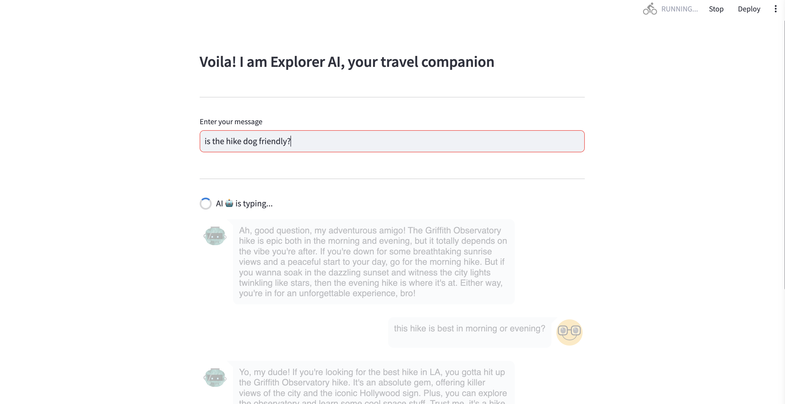
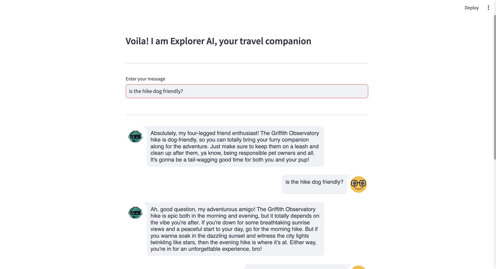

# Explorer AI

Explorer AI is an AI-powered travel companion application developed using Python, Langchain, and Streamlit. This application serves as a personalized assistant for travelers, offering information and insights into travel destinations and outdoor activities.

## Overview

Explorer AI functions similarly to ChatGPT but focuses on the travel domain. With a conversational interface, it provides personalized guidance, destination details, and activity recommendations for travelers.

## Features

- **Personalized Assistance**: Receive tailored suggestions based on your travel preferences.
- **Travel Insights**: Access comprehensive information about diverse travel destinations worldwide.
- **Outdoor Activities**: Explore a wide range of outdoor activities and experiences available at different locations.
- **Conversational Interface**: Interact with Explorer AI using a user-friendly chat interface.


_Screenshot 1_


_Screenshot 2_


_Screenshot 3_


_Screenshot 4_


_Screenshot 5_

## Requirements

- Python 3.7 or higher
- Langchain library
- Streamlit library

## Installation

1. Clone the repository:

2. Install the necessary dependencies:

## Usage

1. Navigate to the project directory:

2. Run the Streamlit application:

   ```bash
   streamlit run main.py
   ```

3. Access the application in your browser at `http://localhost:8501`.
